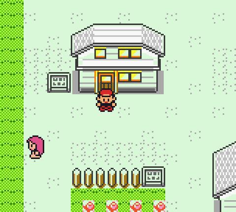
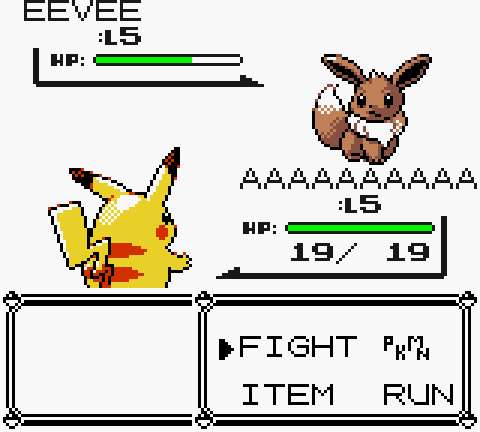
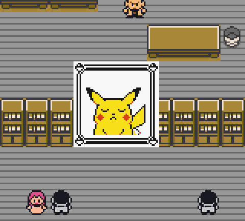

# Pokémon Yellow Color

A playable Game Boy Color enhancement of English Pokémon Yellow, with per-tile
overworld colors and Gen 2 battle graphics. **Version 0.1.1 is a preview build:**
the opening, all tilesets, sprite loaders, menus, saving, and surfing minigame
have automated checks; a complete playthrough and physical hardware testing
are still outstanding.

## Apply the patch

Download [PokemonYellowColor.bps](dist/PokemonYellowColor.bps) and apply it to
an **unmodified English USA/Europe Yellow ROM** with a BPS patcher such as
[Floating IPS](https://github.com/Alcaro/Flips).

| Input property | Required value |
| --- | --- |
| Size | 1,048,576 bytes |
| SHA-1 | `cc7d03262ebfaf2f06772c1a480c7d9d5f4a38e1` |
| CRC32 | `7d527d62` |

The included Python patcher needs only Python 3, with no packages to install:

```sh
python3 scripts/bps.py apply "original-yellow.gbc" dist/PokemonYellowColor.bps "YellowColor.gbc"
```

It verifies the input and all BPS checksums and refuses to overwrite an existing
output. Load the resulting 2 MiB ROM in Game Boy Color mode. Full artifact
checksums are in [dist/manifest.json](dist/manifest.json).

## What changes

- All 25 overworld tilesets have individual terrain and furniture colors.
- Towns use distinct roof palettes; NPCs and the player have object palettes.
- All 151 Pokémon have Gen 2 front and detailed 6×6 back sprites with species
  palettes. Trainer graphics come from the same Gen 2 graphics integration.
- Pikachu's follower and reaction portraits have yellow fur. All 61 portrait
  graphics, including partial animation patches, have separate fur/background
  colors, with white eye highlights and red-orange cheeks.
- Scrolling updates tile graphics and palette attributes together. Full-screen
  menus restore the entire background attribute map on return.
- Yellow's story, encounters, battle rules, follower, voice samples, and surfing
  minigame remain in place. No gameplay rebalance or extra Pokémon are added.





## Build and verify

Building requires a C compiler, GNU Make, Python 3, and **RGBDS 1.0.3**.
Install that version from [RGBDS](https://github.com/gbdev/rgbds/releases/tag/v1.0.3),
then point the build script at its binaries:

```sh
python3 scripts/build.py --base "original-yellow.gbc" --rgbds /path/to/rgbds/bin
```

This builds the ROM locally and creates a verified BPS patch in `dist/`.
The default RGBDS path is `.cache/rgbds`. ROMs, saves, emulator states, and
downloaded development tools are excluded from Git.

For the automated emulator checks:

```sh
python3 -m venv .venv
.venv/bin/python -m pip install -r requirements-dev.txt
.venv/bin/python -m pytest -q
.venv/bin/python scripts/verify_emulator.py
.venv/bin/python scripts/verify_sprites.py
.venv/bin/python scripts/verify_special_scenes.py
.venv/bin/python scripts/build_portraits.py --check
.venv/bin/python scripts/verify_portraits.py
```

Run the scripts in that order, from the repository root, after building.
The first creates emulator states for the later checks. Outputs go to
`build/verification/`. See [testing and limitations](docs/TESTING.md).

## Credits

- [pret/pokeyellow](https://github.com/pret/pokeyellow): the documented Yellow
  disassembly; its pinned baseline reproduces the supported ROM exactly.
- [dannye/pokered-gbc](https://github.com/dannye/pokered-gbc): terrain assignments,
  map and roof palettes, from FroggestSpirit, Drenn, dannye, and contributors.
- [dannye/pokeyellow-gen-2-gfx](https://github.com/dannye/pokeyellow-gen-2-gfx):
  Gen 2 Pokémon/trainer graphics, palettes, and back-sprite integration.
- [RGBDS](https://rgbds.gbdev.io/), [PyBoy](https://github.com/Baekalfen/PyBoy),
  and [Pan Docs](https://gbdev.io/pandocs/): development tools and references.

[Pinned revisions and implementation notes](docs/UPSTREAM.md) document the
upstream contributions and the new color renderer.

This is an unofficial fan project. Original and upstream assets retain their
ownership; no new license is asserted over them. The distributed game artifact
is a patch, not a complete ROM.
