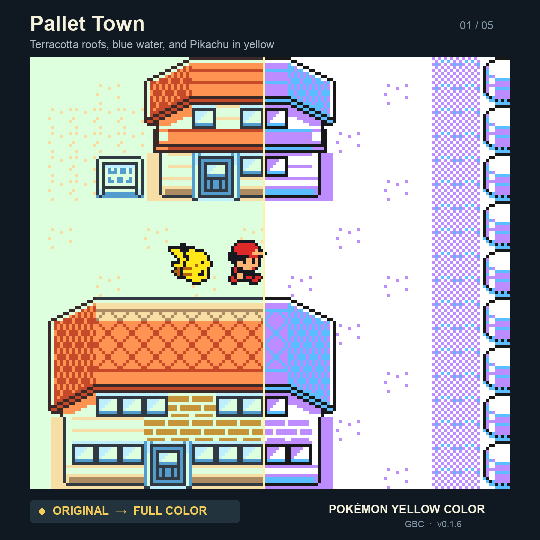
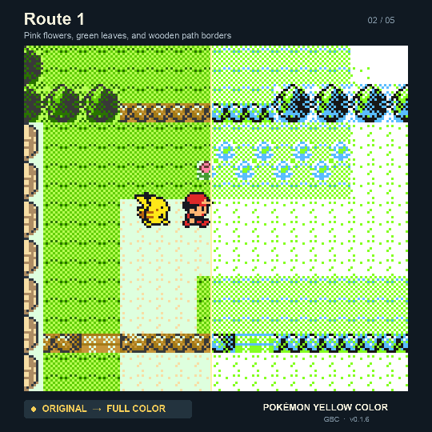
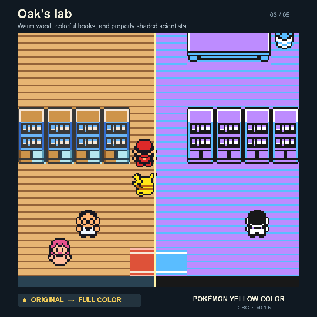
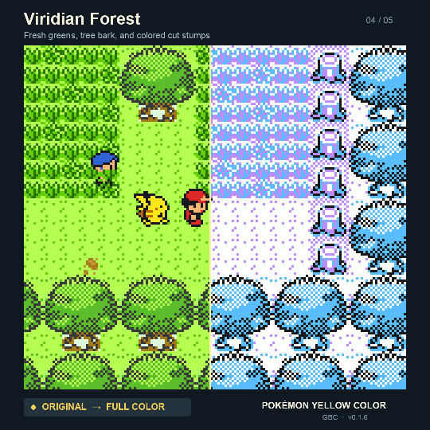
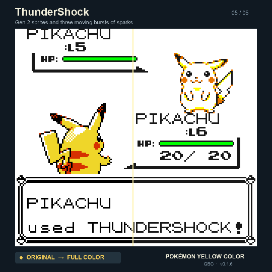

# Before and after

Five original Yellow → Yellow Color comparisons, captured from the actual ROMs
in Game Boy Color mode. Ash keeps walking while a moving wipe reveals the color
version. The battle clip plays the original ThunderShock, reveals the Gen 2
sprites, and then replays the attack with the new spark bursts.

**[Watch the complete 43-second showcase](showcase.mp4).**

MP4s are 1080 × 1080 with stereo game audio. GIFs are silent 540 × 540 loops.
Game pixels use integer nearest-neighbor scaling: 6× in the videos, 3× in GIFs.

| Scene | What it shows | Video | GIF |
| --- | --- | --- | --- |
| Pallet Town | Houses, gardens, water, Ash and Pikachu walking through town | [MP4](pallet.mp4) | [GIF](pallet.gif) |
| Route 1 | Animated pink flowers, green leaves, and wooden path borders | [MP4](route1.mp4) | [GIF](route1.gif) |
| Oak’s lab | Warm wood, books, furniture, and scientists | [MP4](lab.mp4) | [GIF](lab.gif) |
| Viridian Forest | Trees, stumps, grass, and the forest path | [MP4](forest.mp4) | [GIF](forest.gif) |
| ThunderShock | Original versus Gen 2 sprites and attack effects | [MP4](battle.mp4) | [GIF](battle.gif) |

[](pallet.mp4)
[](route1.mp4)
[](lab.mp4)
[](forest.mp4)
[](battle.mp4)

## Capture details

- Before: the supported, unmodified English Yellow ROM. The local baseline
  build was checked byte-for-byte against the supplied dump.
- After: Yellow Color v0.1.6, exactly the ROM produced by the current BPS patch.
- Both use SameBoy’s CGB-E model and the same normal save. The original game’s
  limited GBC colors are preserved; its footage has not been desaturated.
- Walking takes match on map coordinates, camera scroll, step counter, and
  Ash’s animation pose. Original frames are retimed to matching Color
  footsteps. These edits show graphics and are not performance benchmarks.
- Walking videos use continuous game music captured from their Color take.
  The battle uses each version’s own recorded audio. The battle wipe holds
  stationary frames between two replays of the first attack.
- Capture-only RAM fixtures set map positions, the names ASH/PIKACHU, defeated
  forest trainers, encounter suppression during walks, and the Pikachu battle
  with ThunderShock selected. Subsequent movement and the battle turn use real
  button inputs and the normal game engine. ROMs and saved games are unchanged.
- [Capture report](capture-report.json) records ROM hashes, exact frame-match
  counts, frame rates, durations, and individual MP4 checksums.

## Reproduce

Use the local baseline and v0.1.6 ROM builds, their `.sym` files, the normal save
created by `scripts/verify_emulator.py`, and the SameBoy build described in
[testing](../TESTING.md). FFmpeg, a C compiler, NumPy, and Pillow are also needed
(NumPy and Pillow are present in the existing PyBoy development environment).

From the repository root:

```sh
.venv/bin/python scripts/capture_showcase.py --version original
.venv/bin/python scripts/capture_showcase.py --version color
.venv/bin/python scripts/render_showcase.py
```

The capture command builds its optional audio adapter on first use. Raw frames,
PCM audio, emulator states, and chronological review sheets stay in ignored
`build/showcase/`. The renderer writes only media and its report here. Its font
defaults are macOS Arial; use `--font` and `--bold-font` for other systems.

The footage shows an unofficial fan project; original game assets and music
retain their respective ownership. No ROM is included in these media files.
